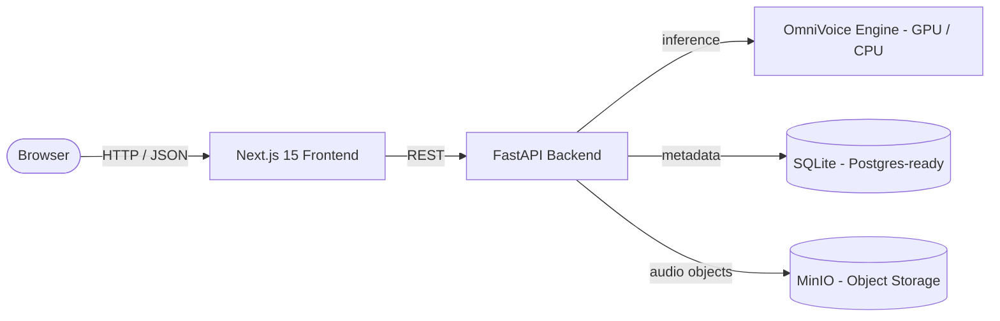

<div align="center">

# OmniVoice App

**Self-hosted Voice Cloning, Text-to-Speech, and Voice Design — powered by [OmniVoice](https://github.com/k2-fsa/OmniVoice).**

A premium, open, self-hostable platform for high-quality multilingual speech synthesis. Clone any voice from a short sample, design entirely new voices from attributes, and generate natural speech in 600+ languages — all running on your own infrastructure.

<!-- PROJECT BANNER -->
<!-- Place the project banner image at docs/assets/banner.png and it will render here. -->


[-blue.svg>)](LICENSE)
[-orange.svg>)](https://github.com/k2-fsa/OmniVoice)
[](https://nextjs.org)
[](https://fastapi.tiangolo.com)
[](docker-compose.yml)

[Quick Start](#quick-start) · [Features](#key-features) · [Architecture](docs/ARCHITECTURE.md) · [Roadmap](docs/ROADMAP.md) · [FAQ](docs/FAQ.md) · [Contributing](CONTRIBUTING.md)

</div>

---

## Overview

OmniVoice App turns the [OmniVoice](https://github.com/k2-fsa/OmniVoice) model into a complete, product-grade application: a polished multi-page web interface, a robust async generation API, voice profile management, generation presets, and object storage — packaged for single-command Docker deployment.

It is designed as **open core**: a free, source-available **Community Edition** you can self-host today, evolving toward optional **Cloud** and **Enterprise** editions. See [docs/COMMERCIAL_MODEL.md](docs/COMMERCIAL_MODEL.md) for the full strategy.

> **Responsible use:** OmniVoice App can synthesize and clone human voices. All use is governed by the [Voice Usage Policy](VOICE_USAGE_POLICY.md). Cloning a real person's voice without their informed consent is prohibited.

---

## Key Features

- 🎙️ **Voice Cloning** — Clone any voice from a short reference recording (upload or record in-browser).
- 🗣️ **Text-to-Speech** — Generate natural speech from text with fine-grained generation controls.
- 🎛️ **Voice Design** — Build entirely new voices from a controlled vocabulary of attributes (gender, age, pitch, accent, style).
- 📚 **Voice Profiles** — Save, edit, search, and reuse voices in a personal voice library.
- ⚙️ **Generation Presets** — Persist generation settings and output formats across sessions.
- ⚡ **GPU Acceleration** — CUDA-accelerated inference with automatic CPU fallback.
- 🌍 **600+ Languages** — Auto-detection or manual language selection.
- 🐳 **Docker Deployment** — Full stack up with a single `docker compose up --build`.
- 🏠 **Self-Hosted** — Your text, audio, and voice data stay on your infrastructure.
- 🔓 **Source-Available** — Read, modify, and self-host under the [Community License](LICENSE).

---

## Screenshot


## Architecture Overview

OmniVoice App is two services — a **Next.js 15 frontend** and a **FastAPI backend** — plus **MinIO** object storage, all orchestrated by Docker Compose. Generation is fire-and-forget: the API returns a job ID immediately and the frontend polls until completion.



For the full design — generation pipeline, cloning pipeline, storage flows, and scalability plan — see **[docs/ARCHITECTURE.md](docs/ARCHITECTURE.md)**.

---

## Technology Stack

**Frontend**

- [Next.js 15](https://nextjs.org) (App Router) + [React 19](https://react.dev)
- [TypeScript](https://www.typescriptlang.org)
- [Tailwind CSS](https://tailwindcss.com)
- [shadcn/ui](https://ui.shadcn.com) (Radix UI primitives)
- [TanStack Query](https://tanstack.com/query) + [Zustand](https://zustand-demo.pmnd.rs) (data & state)
- [wavesurfer.js](https://wavesurfer.xyz) (waveform rendering)

**Backend**

- [FastAPI](https://fastapi.tiangolo.com) + [Uvicorn](https://www.uvicorn.org)
- [Python 3.11+](https://www.python.org)
- [OmniVoice](https://github.com/k2-fsa/OmniVoice) (TTS / cloning / design engine)
- [SQLAlchemy 2](https://www.sqlalchemy.org) + [Pydantic 2](https://docs.pydantic.dev)

**Infrastructure**

- [PostgreSQL](https://www.postgresql.org)-ready persistence (SQLite is the Community Edition default)
- [MinIO](https://min.io) (S3-compatible object storage)
- [Docker](https://www.docker.com) + Docker Compose

---

## Quick Start

### Prerequisites

- Docker & Docker Compose v2
- (Recommended) NVIDIA GPU with CUDA drivers — falls back to CPU if unavailable
- ~3 GB free disk for the OmniVoice model download on first run

### Run

```bash
git clone git@github.com:brunos3d/omnivoice-app.git
cd omnivoice-app

cp .env.example .env

docker compose up --build
```

The first startup downloads the OmniVoice model (~2.5 GB) automatically. When the backend health check passes, open:

- **App:** http://localhost:3000
- **API docs:** http://localhost:8000/docs
- **MinIO console:** http://localhost:9001 (default `minioadmin` / `minioadmin`)

---

## Installation Guide

### Docker deployment (recommended)

The provided [`docker-compose.yml`](docker-compose.yml) starts three services — `backend`, `frontend`, and `minio` — with persistent named volumes for the database, model cache, and object storage.

```bash
docker compose up --build   # build + start everything
docker compose up           # start without rebuilding
docker compose down         # stop
docker compose logs -f backend
```

#### GPU deployment

The compose file requests all available NVIDIA GPUs via the `deploy.resources` reservation. Requirements:

- NVIDIA driver + [NVIDIA Container Toolkit](https://docs.nvidia.com/datacenter/cloud-native/container-toolkit/latest/install-guide.html) installed on the host.
- Verify with `docker run --rm --gpus all nvidia/cuda:12.4.0-base-ubuntu22.04 nvidia-smi`.

GPU is strongly recommended — OmniVoice reaches a real-time factor as low as ~0.025 (≈40× faster than real time) on a capable GPU.

#### CPU deployment

No GPU? OmniVoice App still runs. Remove (or comment out) the `deploy.resources.reservations.devices` block in [`docker-compose.yml`](docker-compose.yml) for the `backend` service, then `docker compose up --build`. Expect substantially slower generation.

### Development setup (without Docker)

**Backend**

```bash
cd backend
python -m venv .venv && source .venv/bin/activate
pip install -r requirements.txt
mkdir -p /tmp/omnivoice-data/{voices,uploads,generated,models}
DATA_DIR=/tmp/omnivoice-data uvicorn app.main:app --reload
```

**Frontend**

```bash
cd frontend
npm install
NEXT_PUBLIC_API_URL=http://localhost:8000 npm run dev
npm run lint        # lint
npm run build       # production build
```

See [CONTRIBUTING.md](CONTRIBUTING.md) for the full development workflow, coding standards, and PR process.

### Environment Variables

All configuration is environment-driven. See [`.env.example`](.env.example) for the complete list.

| Variable           | Default                                  | Description                                  |
| ------------------ | ---------------------------------------- | -------------------------------------------- |
| `DATABASE_URL`     | `sqlite+aiosqlite:////data/omnivoice.db` | Database connection URL (PostgreSQL-ready)   |
| `OMNIVOICE_MODEL`  | `k2-fsa/OmniVoice`                       | HuggingFace model repo or local path         |
| `LOAD_ASR`         | `false`                                  | Load Whisper ASR for reference transcription |
| `ASR_MODEL`        | `openai/whisper-large-v3-turbo`          | ASR model used when `LOAD_ASR=true`          |
| `HF_HOME`          | `/data/models`                           | HuggingFace cache directory                  |
| `CORS_ORIGINS`     | `["http://localhost:3000", ...]`         | Allowed CORS origins                         |
| `MINIO_ENDPOINT`   | `minio:9000`                             | MinIO/S3 endpoint                            |
| `MINIO_ACCESS_KEY` | `minioadmin`                             | MinIO access key (**change in production**)  |
| `MINIO_SECRET_KEY` | `minioadmin`                             | MinIO secret key (**change in production**)  |
| `MINIO_BUCKET`     | `omnivoice`                              | Bucket for generated/reference audio         |
| `MINIO_SECURE`     | `false`                                  | Use TLS for MinIO connections                |

---

## Usage Examples

### Voice Design examples

Voice Design builds a voice from a controlled vocabulary of attributes — one attribute per category — instead of free-text prompts. Categories include **Gender**, **Age**, **Pitch**, **Style**, **English Accent**, and **Chinese Dialect**.

| Goal                     | Attributes                                                      |
| ------------------------ | --------------------------------------------------------------- |
| Warm female narrator     | `female` · `young adult` · `moderate pitch` · `american accent` |
| Authoritative announcer  | `male` · `middle-aged` · `low pitch` · `british accent`         |
| Soft bedtime storyteller | `female` · `elderly` · `low pitch` · `whisper`                  |
| Energetic young host     | `male` · `teenager` · `high pitch` · `australian accent`        |

### Voice Clone examples

1. **Record or upload** a clean 5–15 second reference clip of the target voice (with consent — see the [Voice Usage Policy](VOICE_USAGE_POLICY.md)).
2. **Save it as a profile** in your Voice Library, optionally attaching default generation settings.
3. **Generate** — type your script, pick the profile, and submit. The backend extracts and caches the clone prompt per profile for fast repeat generations.

Tips for best clones: use clean mono audio, minimal background noise, a single speaker, and a consistent speaking style.

---

## Project Roadmap

Short term: better voice management, voice sharing, advanced presets.
Medium term: teams, workspaces, API keys, usage analytics.
Long term: SaaS Edition, billing, enterprise features, multi-tenancy.

Full details and status in **[docs/ROADMAP.md](docs/ROADMAP.md)**.

---

## Contributing

Contributions are welcome! Please read **[CONTRIBUTING.md](CONTRIBUTING.md)** for the development workflow, branch strategy, commit conventions, and PR requirements, and review our **[Code of Conduct](CODE_OF_CONDUCT.md)** before participating.

---

## Security

Found a vulnerability? **Please do not open a public issue.** Follow the responsible-disclosure process in **[SECURITY.md](SECURITY.md)**.

---

## License

OmniVoice App is distributed under the **OmniVoice App Community License** (based on the [Elastic License 2.0](https://www.elastic.co/licensing/elastic-license)) — a source-available license that permits self-hosting and personal, educational, and internal-business use, while prohibiting resale and competing managed/SaaS offerings. See **[LICENSE](LICENSE)** for the full terms and **[docs/COMMERCIAL_MODEL.md](docs/COMMERCIAL_MODEL.md)** for the licensing strategy.

The underlying [OmniVoice](https://github.com/k2-fsa/OmniVoice) engine is licensed under the **Apache License 2.0** and is not modified or restricted by this license. See **[NOTICE](NOTICE)** for attributions.

---

## Acknowledgements

- **[OmniVoice](https://github.com/k2-fsa/OmniVoice) by the [k2-fsa / Next-gen Kaldi](https://github.com/k2-fsa) team** — the massively-multilingual zero-shot TTS and voice-cloning engine that makes this project possible. All voice synthesis is performed by OmniVoice; OmniVoice App is an independent application built on top of it and is not affiliated with or endorsed by the k2-fsa team.
- The open-source maintainers of Next.js, React, FastAPI, MinIO, and the wider ecosystem this project builds on.

---

<div align="center">
<sub>Copyright © 2026 Bruno Silva and the OmniVoice App contributors. Built on OmniVoice (Apache-2.0).</sub>
</div>
