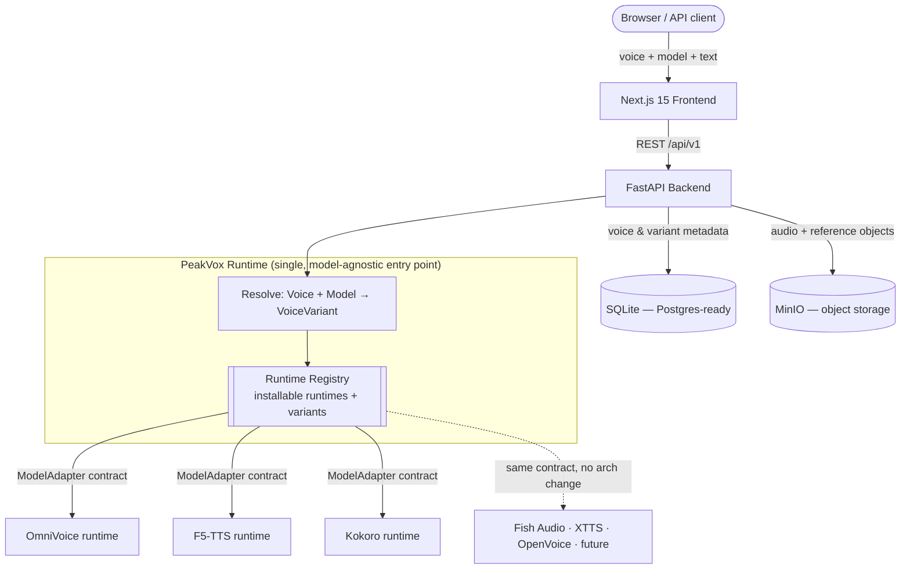

<div align="center">

# PeakVox

**A Universal Voice Runtime — self-hosted, voice-first, model-agnostic.**

Own your voices as portable assets. Run any speech model behind one stable runtime and one
stable API. Add, swap, or remove models without breaking a single integration.

<!-- PROJECT BANNER -->
<!-- Place the project banner image at docs/assets/banner.png and it will render here. -->


[-blue.svg>)](LICENSE)
[](#editions-community-now-cloud-later)
[](docs/.agents/ARCHITECTURE/runtime-architecture.md)
[](https://nextjs.org)
[](https://fastapi.tiangolo.com)
[](docker-compose.yml)

[What it is](#what-peakvox-is) · [Why](#why-peakvox-exists) · [Architecture](#architecture) ·
[Quick Start](#quick-start) · [Editions](#editions-community-now-cloud-later) ·
[Philosophy](PHILOSOPHY.md) · [Contributing](CONTRIBUTING.md) · [Governance](GOVERNANCE.md)

</div>

---

## What PeakVox is

**PeakVox is a Universal Voice Runtime** — model-agnostic infrastructure for speech
generation. The product is **not** any single model. The product is the **runtime layer** that
joins a portable, model-independent **Voice** with an interchangeable **Model** to produce a
model-specific **VoiceVariant**, and then generates speech:

```
Voice  +  Model  ──▶  VoiceVariant  ──▶  generated speech
```

The thesis is one sentence: **a voice should not belong to a model.** A voice belongs to
PeakVox. The same `public_voice_id` survives across every model provider, edition change, and
rebuild — forever. You integrate once; the model underneath becomes a detail you can change at
will.

PeakVox is to voice what a few familiar tools are to text and audio, combined and focused
exclusively on speech:

- **OpenRouter** — model-agnostic routing through one API.
- **Ollama / LM Studio** — effortless local, self-hosted runtime + model lifecycle.
- **Hugging Face** — a registry of installable runtimes and assets.
- **ElevenLabs** — voice products and (eventually) a creator economy.

OmniVoice ([k2-fsa/OmniVoice](https://github.com/k2-fsa/OmniVoice)) is simply the **first
provider** the runtime supports. F5-TTS and Kokoro ship today as additional runtimes; Fish
Audio, XTTS, OpenVoice, and future models integrate behind the same contract — **without any
architectural change**.

> **Heads up on the name:** PeakVox began as a single-model app called "OmniVoice App". It is
> no longer that. OmniVoice is now one *provider* among several; PeakVox is the runtime above
> all of them. You do not need the historical context to understand the project — this README
> is the canonical, current entry point.

---

## Why PeakVox exists

Voice models come and go. They differ in quality, latency, cost, language coverage, licensing,
and capabilities (cloning, voice design, singing, streaming). If your voices, your library,
your API, and your integrations are wired to one model, every model change is a migration.

PeakVox removes that coupling structurally:

| The platform owns | Models only |
|---|---|
| Voices (portable, ownable assets) | Consume voices to synthesize speech |
| Variants, metadata, characteristics | Declare their capabilities |
| Workflows, the public API, runtime orchestration | Run as interchangeable execution engines |

- **Voices are durable assets.** Persistent, ownable, model-independent.
- **Models are replaceable execution engines.** Add one, swap one, remove one — freely.
- **Providers are implementation details.** They never leak into the public API or the UI.

**Voices do not belong to models.** This single distinction governs the entire architecture.

---

## Key capabilities (Community Edition, today)

- 🎙️ **Voice Cloning** — create a voice from a short reference recording (upload or record
  in-browser), as a portable Voice with a permanent `public_voice_id`.
- 🎛️ **Voice Design** — build new voices from a controlled vocabulary of attributes (gender,
  age, pitch, accent, style), where the selected model declares the capability.
- 🗣️ **Text-to-Speech** — `voice + model + text`. Switch the model; the voice and the
  integration shape stay identical.
- 📚 **Voice Library** — search, filter, favorite, and reuse voices addressed by
  `public_voice_id`. My / Community / Preset / Recently-Used.
- 🧩 **Runtime Registry** — install, activate, and run multiple speech runtimes locally
  (OmniVoice, F5-TTS, Kokoro today). Each runtime is a self-contained, versioned service.
- 🧬 **Runtime Variants** — share one runtime image across many model variations
  (e.g. base vs. fine-tuned checkpoints) instead of rebuilding a multi-GB image per variant.
- 🔌 **Capability-driven UI & API** — model-specific controls (singing, emotion, design,
  streaming) appear **only** when the active model declares them. No per-model hard-coding.
- ⚡ **GPU or CPU** — CUDA-accelerated where available, CPU-capable runtimes (e.g. Kokoro) for
  hardware-light setups.
- 🐳 **One-command self-hosting** — full stack via Docker Compose. Your text, audio, and voice
  data stay on your infrastructure.
- 🔓 **Source-available** — read, modify, and self-host under the [Community License](LICENSE).

---

## Core concepts

A newcomer only needs five terms. Full definitions in the
[Glossary](docs/.agents/CONTEXT/GLOSSARY.md) and [Domain Model](docs/.agents/DOMAIN_MODEL.md).

| Concept | What it is |
|---|---|
| **Voice** | A portable, model-agnostic identity. Addressed by a permanent `public_voice_id`. The thing you own. |
| **Model / Provider** | An interchangeable inference engine (OmniVoice, F5-TTS, Kokoro, …). Declares its capabilities. |
| **VoiceVariant** | The model-specific realization of a Voice (the artifacts one model needs). **Internal — never on the public API.** |
| **Runtime** | The single entry point that resolves `Voice + Model → VoiceVariant → inference`. All generation routes through it. |
| **Runtime Registry / Runtime Variant** | The registry installs **runtimes** (a runtime = environment + service contract). A **Runtime Variant** reuses one runtime image for many model variations (different weights/config), so a fine-tune doesn't mean a new multi-GB build. |

The load-bearing rule: **`public_voice_id` is a permanent public contract.** It is immutable
and survives across providers, editions, and rebuilds. A VoiceVariant — embeddings,
checkpoints, model-specific artifacts — is never exposed publicly. The public surface speaks
only **Voice + Model**.

---

## Architecture

PeakVox runs as a **Next.js 15 frontend** and a **FastAPI backend**, plus **MinIO** object
storage, orchestrated by Docker Compose. The backend never imports a model implementation
directly — every model integrates through the `ModelAdapter` contract, and all generation
routes through the single `PeakVoxRuntime` entry point.



Two things the diagram makes load-bearing:

1. **Nothing above the adapter line knows which model it is talking to.** Adding a provider is
   wiring a new adapter + runtime descriptor — never an API, schema, or UI change.
2. **Capabilities are declared, not inferred.** The UI and API read each model's
   `ModelCapabilities`; they never branch on a model id or name.

**Deep dives (authoritative):**
[Architecture overview](docs/.agents/ARCHITECTURE/overview.md) ·
[Runtime architecture](docs/.agents/ARCHITECTURE/runtime-architecture.md) ·
[Voice domain model](docs/.agents/ARCHITECTURE/VOICE_DOMAIN_MODEL.md) ·
[Vision (north star)](docs/.agents/CONTEXT/VISION.md) ·
[Constitution (invariants)](docs/.agents/CONSTITUTION.md) ·
[ADR index](docs/.agents/DECISIONS/ADR_INDEX.md) ·
[Roadmap](docs/.agents/ROADMAP/ROADMAP.md)

---

## Editions: Community now, Cloud later

PeakVox is **open core**. Community Edition and Cloud Edition share **one** architectural
foundation — commercial concepts are schema-ready in CE behind feature flags, never a forked
schema. Enabling them in Cloud is wiring, not a redesign.

| | **Community Edition (CE)** — the focus today | **PeakVox Cloud** — the vision |
|---|---|---|
| Role | Infrastructure layer | Ecosystem layer |
| Hosting | Self-hosted (Docker Compose) | Managed, multi-tenant |
| Generation, runtimes, voice library, public API | ✅ | ✅ |
| Model / runtime management | ✅ install · activate · run locally | ✅ |
| Auth | None (local owner) | Accounts + roles (swappable provider) |
| Marketplace · creators · royalties · credits · billing | **Schema-ready, disabled** | Enabled |

### Community Edition — the primary target

**Today, PeakVox is Community Edition first.** CE is the entire focus of active development and
is genuinely useful on its own:

- Self-hosted deployment you fully control.
- Open-source collaboration and transparent, ADR-driven evolution.
- Developer accessibility — one integration, many models.
- Model experimentation and **runtime extensibility** via the Runtime Registry.

CE is not a teaser for a paid product. It is the product, today.

### Cloud Edition — vision, not a promise

PeakVox is **designed** so that a future Cloud Edition shares CE's foundation rather than
forking it. This section is **direction, not commitment** — there are no dates, no guarantees,
and no purchasing here.

Potential future cloud offerings *may* explore: hosted runtimes, managed infrastructure,
simplified deployment, managed voice libraries, and hosted APIs — built so the ecosystem stays
unified rather than fragmented. The open-core boundary (marketplace, creators, royalties,
credits, payouts, multi-tenant auth as Cloud-only) exists in the architecture from day one,
disabled in CE. See [Product Architecture](docs/.agents/ARCHITECTURE/product-architecture.md)
and [Cloud Architecture](docs/.agents/ARCHITECTURE/cloud-architecture.md).

---

## Open-source philosophy

Open models matter. Open ecosystems matter. Voice technology should remain accessible, and
voice infrastructure should not be locked behind proprietary systems. PeakVox aims to stay
extensible, transparent, and built in public. The full statement is in
**[PHILOSOPHY.md](PHILOSOPHY.md)**; how decisions are made is in
**[GOVERNANCE.md](GOVERNANCE.md)**; the community we want to be is in
**[COMMUNITY_VALUES.md](COMMUNITY_VALUES.md)**.

> **Responsible use:** PeakVox can synthesize and clone human voices. All use is governed by
> the [Voice Usage Policy](VOICE_USAGE_POLICY.md). Cloning a real person's voice without their
> informed, documented consent is prohibited.

---

## Quick Start

### Prerequisites

- Docker & Docker Compose v2.
- (Recommended) NVIDIA GPU with CUDA drivers for the heavier runtimes — CPU-capable runtimes
  (e.g. Kokoro) run without one.
- Disk for the runtime image(s) you install on first run (runtimes range from ~hundreds of MB
  to several GB depending on the model).

### Run

```bash
git clone https://github.com/brunos3d/omnivoice-app.git
cd omnivoice-app

cp .env.example .env

docker compose up --build
```

> The repository slug (`omnivoice-app`) predates the rename to PeakVox; the clone command above
> is current and correct.

When the backend health check passes, open:

- **App:** http://localhost:3000
- **API docs:** http://localhost:8000/docs
- **MinIO console:** http://localhost:9001 (default `minioadmin` / `minioadmin` — change before
  any non-local use; see [SECURITY.md](SECURITY.md))

The first time you activate a runtime from the Models page, PeakVox installs it via the
**Runtime Registry**. Runtimes are immutable, versioned services managed by the runtime driver
— not rebuilt on every change.

### Development (hot reload, no image rebuilds)

```bash
scripts/start-dev.sh        # backend + MinIO in Docker (uvicorn --reload); frontend on host (next dev)
scripts/start-dev.sh --build  # rebuild only when backend deps/Dockerfile changed
```

Editing `backend/app/` reloads the API in seconds; editing `frontend/src/` hot-reloads the UI.
See [CONTRIBUTING.md](CONTRIBUTING.md) for the full workflow, standards, and PR process.

### Environment variables

All configuration is environment-driven; [`.env.example`](.env.example) is the source of truth.
The MinIO values below are set by `docker-compose.yml`. Common variables:

| Variable | Default | Description |
| --- | --- | --- |
| `DATABASE_URL` | `sqlite+aiosqlite:////data/omnivoice.db` | Database connection URL (PostgreSQL-ready). |
| `HF_HOME` | `/data/models` | Hugging Face cache directory (runtime weights/checkpoints). |
| `LOAD_ASR` | `false` | Load Whisper ASR for reference transcription. |
| `CORS_ORIGINS` | `["http://localhost:3000", ...]` | Allowed CORS origins. Scope these in production. |
| `MINIO_ENDPOINT` | `minio:9000` | MinIO / S3 endpoint. |
| `MINIO_ACCESS_KEY` | `minioadmin` | MinIO access key (**change in production**). |
| `MINIO_SECRET_KEY` | `minioadmin` | MinIO secret key (**change in production**). |
| `MINIO_BUCKET` | `omnivoice` | Bucket for generated/reference audio. |
| `MINIO_SECURE` | `false` | Use TLS for MinIO connections. |

> Some identifiers (the SQLite filename, the MinIO bucket, the `omnivoice_data` volume) retain
> the original repository slug for deployment compatibility — renaming them would migrate
> existing data. They are internal names, not the project's identity: the project is PeakVox.

---

## Technology stack

**Frontend** — [Next.js 15](https://nextjs.org) (App Router) + [React 19](https://react.dev),
[TypeScript](https://www.typescriptlang.org), [Tailwind CSS](https://tailwindcss.com),
[shadcn/ui](https://ui.shadcn.com), [TanStack Query](https://tanstack.com/query) +
[Zustand](https://zustand-demo.pmnd.rs), [wavesurfer.js](https://wavesurfer.xyz).

**Backend** — [FastAPI](https://fastapi.tiangolo.com) + [Uvicorn](https://www.uvicorn.org),
[Python 3.11+](https://www.python.org), [SQLAlchemy 2](https://www.sqlalchemy.org) +
[Pydantic 2](https://docs.pydantic.dev). Models integrate through the `ModelAdapter` contract;
runtimes run as registry-managed services.

**Infrastructure** — [PostgreSQL](https://www.postgresql.org)-ready persistence (SQLite is the
CE default), [MinIO](https://min.io) object storage, [Docker](https://www.docker.com) Compose.

---

## How PeakVox differs

- **Not a model frontend.** It is a runtime above many models. OmniVoice is the first provider,
  not the center of gravity.
- **Voices outlive models.** `public_voice_id` is permanent and provider-independent.
- **One integration, forever.** Adding a model is wiring, never a breaking change to the API,
  Voice IDs, the library, or your code.
- **Honest about validation.** PeakVox distinguishes *architecture-validated* (the platform can
  orchestrate it, proven by tests) from *provider-validated* (a real model generates audio
  end-to-end). See the [retrospectives](docs/.agents/VALIDATION/RETROSPECTIVES/).

---

## FAQ

**Is this just a UI for OmniVoice?** No. PeakVox is a model-agnostic runtime. OmniVoice is one
provider; F5-TTS and Kokoro also ship today, and more integrate behind the same contract.

**Do I need a GPU?** Not for every runtime. CPU-capable runtimes (e.g. Kokoro, 82M params) run
without one; heavier runtimes are much faster on CUDA.

**What's the difference between a Runtime and a Runtime Variant?** A *runtime* is the
environment + service contract (image, deps, server). A *runtime variant* reuses one runtime
image for several model variations (e.g. base vs. a fine-tuned checkpoint) so a new variant
doesn't require a new multi-GB build. See
[ADR-0018](docs/.agents/DECISIONS/adr-0018-runtime-variants-architecture.md).

**Can I add my own model?** Yes — propose a runtime/provider via the
[contribution process](CONTRIBUTING.md). New runtimes and model families go through an ADR and
the Runtime Registry; they never require changing the public API.

**Is the marketplace / billing available?** No. Those are Cloud-only and schema-ready but
disabled in Community Edition. CE is fully functional without them.

---

## Contributing

Contributions are welcome. Read **[CONTRIBUTING.md](CONTRIBUTING.md)** for the workflow, how
architecture decisions are made (ADRs), and how to propose new runtimes or model families.
Review the **[Code of Conduct](CODE_OF_CONDUCT.md)** and **[Governance](GOVERNANCE.md)** before
participating.

## Security

Found a vulnerability? **Please do not open a public issue.** Follow the responsible-disclosure
process in **[SECURITY.md](SECURITY.md)**.

## License

PeakVox is distributed under the **PeakVox Community License** (based on the
[Elastic License 2.0](https://www.elastic.co/licensing/elastic-license)) — a source-available
license permitting self-hosting and personal, educational, and internal-business use, while
prohibiting resale and competing managed/SaaS offerings. See **[LICENSE](LICENSE)** for the
full terms.

The bundled model runtimes are governed by **their own upstream licenses** and are not
modified or restricted by this license — including [OmniVoice](https://github.com/k2-fsa/OmniVoice)
(Apache-2.0). See **[NOTICE](NOTICE)** for attributions.

## Acknowledgements

- The open model communities whose runtimes PeakVox integrates — **[OmniVoice](https://github.com/k2-fsa/OmniVoice)**
  by the [k2-fsa / Next-gen Kaldi](https://github.com/k2-fsa) team, **F5-TTS**, **Kokoro**, and
  the providers integrating next. PeakVox orchestrates these engines; it is an independent
  project and is not affiliated with or endorsed by their respective teams.
- The maintainers of Next.js, React, FastAPI, MinIO, and the wider ecosystem PeakVox builds on.

---

<div align="center">
<sub>Copyright © 2026 Bruno Silva and the PeakVox contributors. A Universal Voice Runtime.</sub>
</div>
