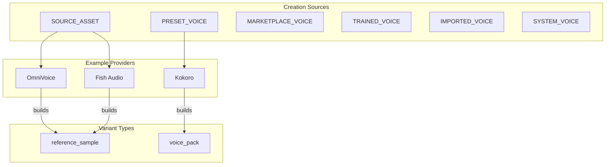
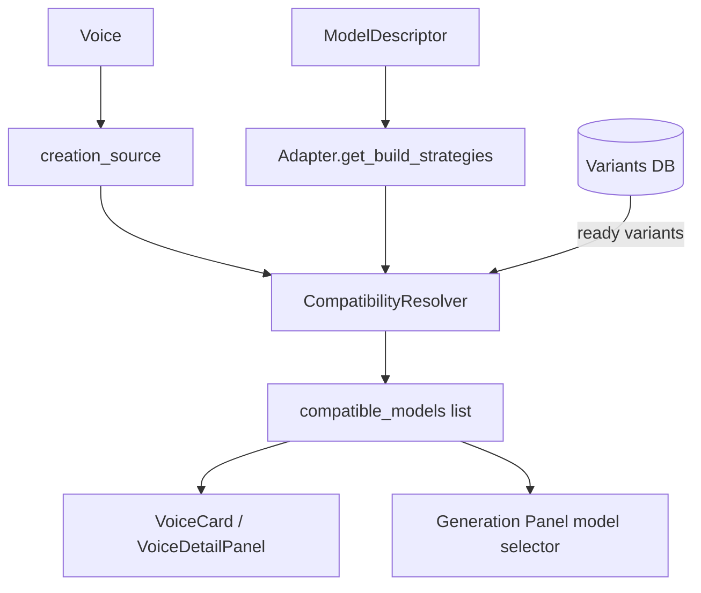
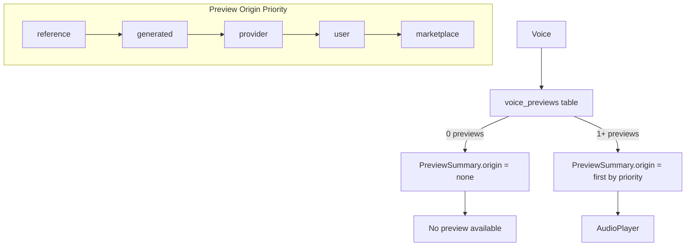
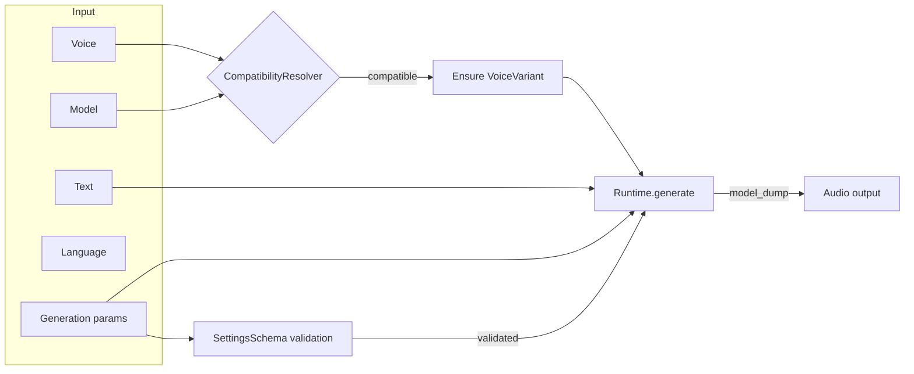
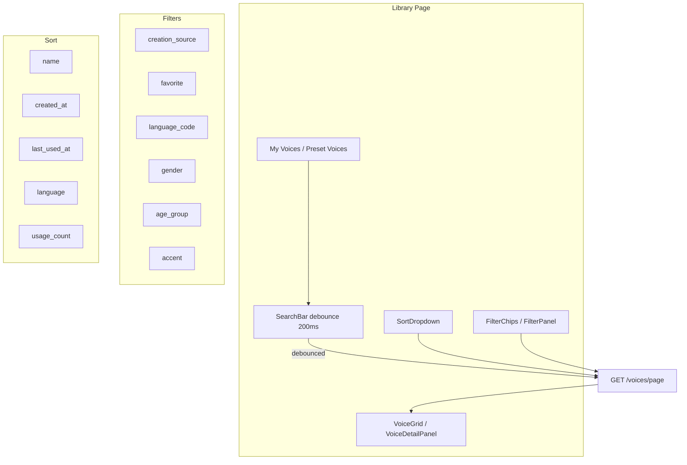

# VOICE DOMAIN MODEL

> **Canonical domain document for the PeakVox voice system.**
> Read this first to understand the entity model, ownership boundaries, creation flows,
> compatibility, previews, and library UX — before opening ADRs or code.

**Related:** [`../DOMAIN_MODEL.md`](../DOMAIN_MODEL.md) (readable map) ·
[`../CONSTITUTION.md`](../CONSTITUTION.md) (invariants) ·
[`../DECISIONS/ADR_INDEX.md`](../DECISIONS/ADR_INDEX.md) (decisions) ·
[`../SPECS/FEATURES/peakvox-voice-system-evolution/`](../SPECS/FEATURES/peakvox-voice-system-evolution/) (spec)

---

## Entity Hierarchy

```
Voice                      model-agnostic identity + economic asset
 ├── Creation Source       how this Voice came to exist (one of six types)
 ├── Characteristics       derived traits for search/filter
 ├── Source Asset          reference audio (SOURCE_ASSET only)
 ├── VoiceVariant(s)       per-model realizations
 │    └── Artifact(s)      versioned build outputs
 ├── VoicePreview(s)       playable audio samples
 └── Favorites             is_favorite boolean (CE) / voice_favorites table (Cloud)

VoiceResource              transient catalog descriptor (NOT persisted)
 ├── resource_type         preset | marketplace | imported | generated
 ├── is_in_library         has this been imported?
 └── library_voice_id      → Voice if imported

ModelDescriptor            inference engine contract
 ├── Capabilities          declared features (ADR-0003)
 ├── VoiceFeatures         derived view of supported voice types
 ├── SettingsSchema        code-declared generation parameters
 └── BuildStrategies       which creation sources this model can build
```

---

## Ownership Boundaries

| Entity | Owns | Never Owns |
|--------|------|------------|
| **Voice** | Identity (`public_voice_id`), creation source, characteristics, favorites | Variant artifacts, model internals, preview storage |
| **VoiceVariant** | Per-model realization, build state machine | The voice identity, source audio, output audio |
| **VoiceArtifact** | Versioned build outputs, retention policy | Which variant it belongs to, what model produced it |
| **VoicePreview** | Playable audio samples, preview metadata | Source audio, variant artifacts |
| **VoiceResource** | Catalog metadata, import status | Persistent identity, variants, artifacts |
| **ModelDescriptor** | Capability declaration, settings schema, build strategies | Voice data, user data |

**The binding rule:** A VoiceVariant is **never** exposed on the public API. The public surface
speaks only `Voice + Model`. (ADR-0004, Constitution Article II §6.)

**The type rule:** `VoiceDetailPanel` never branches on voice type to decide layout. It branches
only on **data availability** and **action availability**. (DESIGN.md D10 — Phase K.)

---

## Creation Sources

A Voice records *how it came to exist* via `creation_source`. This is set once at creation
and never changes. Creation Source is **orthogonal** to Variant (realization). (ADR-0011.)



| Source | Meaning | Status | Variant Provisioning |
|--------|---------|--------|---------------------|
| `SOURCE_ASSET` | Cloned from reference audio | **Implemented** — OmniVoice, Fish Audio | Build from source asset (ADR-0010) |
| `PRESET_VOICE` | Provider-native preset | **Implemented** — Kokoro | Select preset name, no build needed |
| `MARKETPLACE_VOICE` | Purchased/published voice | Reserved (Cloud) | Artifacts may ship with voice |
| `TRAINED_VOICE` | Fine-tune / LoRA / checkpoint | Reserved | Provider-specific training pipeline |
| `IMPORTED_VOICE` | External ecosystem import | Reserved | Translate external artifacts |
| `SYSTEM_VOICE` | Platform-owned voice | Reserved | Prebuilt or preset-like |

---

## Compatibility Flow

Compatibility is **derived**, not stored. The `CompatibilityResolver` is the single source
of truth. (ADR-0002 §3.4, DESIGN.md D4 — Phase B.)



**Compatibility rule:**
> A voice V is compatible with model M IF:
>   (a) a ready `VoiceVariant` exists for `(V, M)`, OR
>   (b) M's adapter declares a `VariantBuildStrategy` for
>       `V.creation_source` with `can_build=True`.

### VariantBuildStrategy

Each adapter declares which creation sources it can build for:

| Adapter | Strategy | Requires |
|---------|----------|----------|
| OmniVoice | `SOURCE_ASSET → can_build=True` | `source_asset` |
| Kokoro | `PRESET_VOICE → can_build=True` | `preset_name`, `provider` |
| Fish Audio | `SOURCE_ASSET → can_build=True` | `source_asset` |

Future adapters (Dia, XTTS, F5-TTS, CosyVoice, SparkTTS) implement `get_build_strategies()`
declaring their supported creation sources as they are onboarded.

### Primary vs Recommended Model

- **`primary_model_id`**: Persisted, set at creation, never changes. The voice knows its
  own model. (DESIGN.md D11.)
- **`recommended_model_id`**: Derived at read time from `compatible_models`. May adapt
  over time as models are added/removed.
- Model pre-selection is **automatic** for the common case: generation panel defaults
  to `recommended_model_id`.

---

## VoicePreview System

VoicePreviews are playable audio samples stored in the `voice_previews` table.
(Phase E, DESIGN.md D5.)



**`preview_summary`** is a Pydantic validator on `VoiceProfileResponse`:
- Derives `origin` heuristically from `audio_duration + creation_source` (Phase D)
- Overridden by `_enrich_preview_summary()` which queries DB records (Phase E)
- `origin: "none"` when no previews exist

**API:** `GET /voices/{id}/previews` with optional filters: `language`,
`preview_origin`, `source_model_id`.

### AudioPlayer States

| State | Condition | Behavior |
|-------|-----------|----------|
| Empty | `origin === "none"` | No controls, "No preview available" |
| Single | One preview | Play/pause/seek/download |
| Multi | Multiple previews | Language/model selector (Phase K) |

---

## TTS Generation Flow



**Flow detail:**
1. User selects voice + model (or accepts defaults)
2. Frontend validates compatibility via `compatible_models` from `GET /voices`
3. `POST /generate` sends `voice_id + model_id + text + params`
4. Runtime resolves variant: `ensure_variant(voice, model)` → builds if missing
5. Runtime validates capabilities, tags, parameters against `SettingsSchema`
6. Adapter `generate()` produces audio
7. Job returned: client polls `GET /jobs/{id}` until `completed` or `failed`
8. On completion: `last_used_at` updated (Phase L)

---

## Voice Library Flow



**Backend:** `GET /voices/page` — cursor-based pagination with sort + filter params.

**Defaults:** `sort_by=last_used_at&sort_dir=desc`, max 100 per page.

**Sort fields:** `name`, `created_at`, `last_used_at`, `language`, `usage_count`.

**Filter params:** `creation_source`, `provider`, `language_code`, `gender`,
`age_group`, `accent`, `favorite`, `search` (ILIKE on name).

**Pagination:** Opaque cursor token (`next_cursor`), not page numbers. Frontend uses
InfiniteQuery for "Load more" or virtual scrolling at 100+ threshold.

---

## Common Architectural Mistakes

### 1. Preset treated as cloned voice

**Bug:** Preset voices (Kokoro) show "Source Audio" badge, play button without audio,
Infinity duration.

**Root cause:** Catalog resources and library voices treated identically. The UI checked
`audio_duration > 0` but not `preview_summary.origin`.

**Fix:** `VoiceDetailPanel` and `VoiceCard` check `preview_summary.origin !== "none"`
before showing play controls. Creation source badge is always from `creation_source`,
never derived from `audio_duration`.

### 2. Compatibility assumed from capability flags

**Bug:** Kokoro (`supports_voice_cloning: false`) incorrectly listed as compatible with
`SOURCE_ASSET` voices via default `get_compatible_models` logic.

**Root cause:** Early compatibility check used `capabilities.supports_voice_cloning`
which is too coarse. A model may support cloning in theory but lack an adapter
implementation for a given creation source.

**Fix:** Compatibility resolved through `CompatibilityResolver` using explicit
`VariantBuildStrategy` declarations. Capability flags are for feature gating (UI
controls), not compatibility resolution.

### 3. Single preview column assumed

**Bug:** `preview_audio` column on Voice could only hold one audio reference. Multi-
language voices or voices with `provider` + `generated` previews had to overwrite.

**Root cause:** Preview was modelled as a Voice property, not a first-class entity.

**Fix:** `VoicePreview` as separate table with `preview_origin` enum. `preview_summary`
is derived at read time from the collection of previews.

### 4. Tab layout branched on voice type

**Bug:** `VoiceDetailsDrawer` hid the Source tab for preset voices but kept the tab
structure — causing 4-tab vs 3-tab grid mismatch, broken tab indices, and empty tabs.

**Root cause:** UI branched on `is_preset_voice` to decide layout, violating the
"same component everywhere" rule.

**Fix:** `VoiceDetailPanel` uses collapsible sections (not tabs). Sections collapse
when data is unavailable. No branching on voice type — only on data availability.

### 5. Model-specific hardcoding in frontend

**Bug:** Capability labels, supported operations, and badge rendering assumed OmniVoice
defaults. Kokoro voices showed "OmniVoice" provider badge, incorrect language lists,
wrong generation defaults display.

**Root cause:** Frontend rendered from hardcoded knowledge instead of `ModelCapabilities`.

**Fix:** All UI reads `model.capabilities`, `model.voice_features`, `model.settings_schema`.
Never switch on model id/name. `LanguageCombobox` reads `model.supported_languages`.

### 6. Preview origin derivation inconsistency

**Bug:** `derive_preview_summary()` Pydantic validator (Phase D) and
`_enrich_preview_summary()` helper (Phase E) disagreed on origin when both ran.

**Root cause:** Two independent derivation paths with no defined priority.

**Fix:** Pydantic `model_validator` phase: heuristic default (`"none"` if no duration,
`"reference"` if `SOURCE_ASSET` with duration). DB enrichment phase: overrides if
preview records exist. Both cooperate — validator sets baseline, enrichment upgrades.

---

## How to Add a New Provider

### Provider Adapter Contract

Each provider integrates through the `ModelAdapter` contract at
`backend/app/services/model_adapter.py`:

```python
class YourAdapter(ModelAdapter):
    # --- Required lifecycle ---
    async def install(self) -> None: ...
    async def load(self) -> None: ...
    def unload(self) -> None: ...
    async def health_check(self) -> bool: ...

    # --- Required inference ---
    async def generate(self, *, text, output_path, ...) -> tuple[float, list[str]]: ...
    async def clone_voice(self, *, db, voice, reference_audio_key) -> VoiceVariant: ...
    async def build_variant(self, *, db, voice) -> VoiceVariant: ...

    # --- Optional: declare build strategies (required for compatibility) ---
    @staticmethod
    def get_build_strategies() -> list[VariantBuildStrategy]: ...

    # --- Optional: list provider-native preset voices ---
    def list_provider_voices(self) -> list[ProviderVoice]: ...
```

### Registration

Register the adapter in `backend/app/services/runtime.py` — the `PeakVoxRuntime.__init__`
or a startup hook calls `register_adapter(YourAdapter(descriptor))`.

### Provider Checklist

| Step | What | References |
|------|------|------------|
| 1 | Create adapter file in `model_adapters/` | `omnivoice_adapter.py`, `kokoro_adapter.py` |
| 2 | Define `ModelDescriptor` in `model_catalog.py` | Capabilities, languages, settings_schema |
| 3 | Implement `get_build_strategies()` | Declare which creation sources you support |
| 4 | Implement lifecycle methods | install, load, unload, health_check |
| 5 | Implement inference methods | generate, clone_voice, build_variant |
| 6 | Register adapter in `runtime.py` setup | `register_adapter(YourAdapter(descriptor))` |
| 7 | `voice_features` auto-derives from strategies + capabilities | Phase F — no extra work needed |
| 8 | Compatibility auto-resolves via `CompatibilityResolver` | Phase B — no changes needed |

### Provider-Specific Notes

| Provider | Creation Sources | Variant Type | Strategy |
|----------|-----------------|--------------|----------|
| **OmniVoice** | `SOURCE_ASSET` | `reference_sample` | Build from reference audio |
| **Kokoro** | `PRESET_VOICE` | `voice_pack` | Select preset name |
| **Fish Audio** | `SOURCE_ASSET` | `reference_sample` | Build from reference audio |
| **Dia** | TBD | TBD | NotImplemented |
| **XTTS** | TBD | TBD | NotImplemented |
| **F5-TTS** | TBD | TBD | NotImplemented |
| **CosyVoice** | TBD | TBD | NotImplemented |
| **SparkTTS** | TBD | TBD | NotImplemented |

### Strategy Declaration Pattern

```python
@staticmethod
def get_build_strategies() -> list[VariantBuildStrategy]:
    return [
        VariantBuildStrategy(
            creation_source="SOURCE_ASSET",
            can_build=True,
            requires=["source_asset"],
            description="Clones a voice from reference audio.",
        ),
        VariantBuildStrategy(
            creation_source="PRESET_VOICE",
            can_build=True,
            requires=["preset_name", "provider"],
            description="Realizes a preset voice from provider pack.",
        ),
    ]
```

### Settings Schema Pattern

Each model declares a `settings_schema` — code-declared, never persisted (Phase A):

```python
settings_schema=SettingsSchema(
    properties={
        "speed": ParameterSchema(
            type="number", label="Speed",
            default=1.0, minimum=0.5, maximum=2.0, step=0.1,
        ),
    },
    required=[],
)
```

The frontend renders this with `DynamicSettingsForm`. Models without a schema get the
OmniVoice fallback form.

---

## Entity State Machines

### VoiceVariant Build Lifecycle (ADR-0008)

```
pending → building → ready
  ↓          ↓
  └──→ failed ──→ building (retry)
ready → deprecated → building (rebuild)
```

### VoiceVariant Status Values

| Status | Meaning | Can generate? |
|--------|---------|---------------|
| `pending` | Not yet built | No |
| `building` | Build in progress | No |
| `ready` | Built and usable | Yes |
| `failed` | Build error | No |
| `deprecated` | Artifact outdated | No (rebuild required) |

---

## Key Code References

| Concept | File | Lines |
|---------|------|-------|
| VoiceProfileResponse | `backend/app/schemas/voice.py` | PreviewSummary validator, compatible_models |
| VoicePreview table | `backend/app/models/db.py` | 274-288 |
| VoicePreview schemas | `backend/app/schemas/voice_preview.py` | Full file |
| Preview repository | `backend/app/services/voice_preview_repository.py` | list_previews, get_preview_summary |
| Preview API | `backend/app/api/voices.py` | `_enrich_preview_summary`, GET /voices/{id}/previews |
| CompatibilityResolver | `backend/app/services/compatibility_resolver.py` | get_compatible_models |
| VariantBuildStrategy | `backend/app/services/model_adapter.py` | 28-40 |
| ModelVoiceFeatures | `backend/app/models/registry_types.py` | derive_voice_features |
| OmniVoice strategies | `backend/app/services/model_adapters/omnivoice_adapter.py` | 52-61 |
| Kokoro strategies | `backend/app/services/model_adapters/kokoro_adapter.py` | 160-169 |
| Fish Audio strategies | `backend/app/services/model_adapters/fish_adapter.py` | 51-60 |
| GET /models | `backend/app/api/models.py` | `_descriptor_payload` with voice_features |
| Voice Library page | `frontend/src/app/voices/page.tsx` | Full file |
| VoiceDetailPanel | `frontend/src/components/voice/VoiceDetailPanel.tsx` | Full file (Phase K) |
| SortDropdown | `frontend/src/components/common/SortDropdown.tsx` | Full file (Phase J) |
| FilterChips | `frontend/src/components/common/FilterChips.tsx` | Full file (Phase J) |
| ModelCard | `frontend/src/components/generation/ModelCard.tsx` | voice_features rendering (Phase F) |
| Frontend types | `frontend/src/types/index.ts` | VoiceProfile, Model, VoicePreview |
| API client | `frontend/src/lib/api.ts` | fetchVoicesPage, fetchVoicePreviews |
