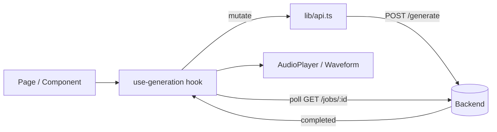
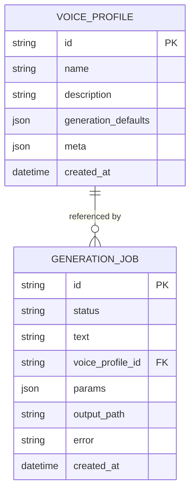
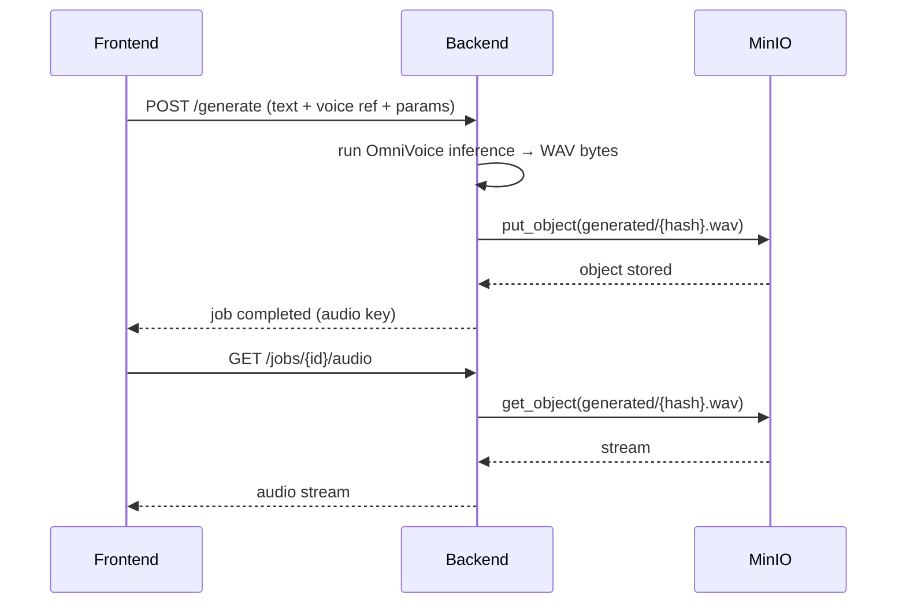
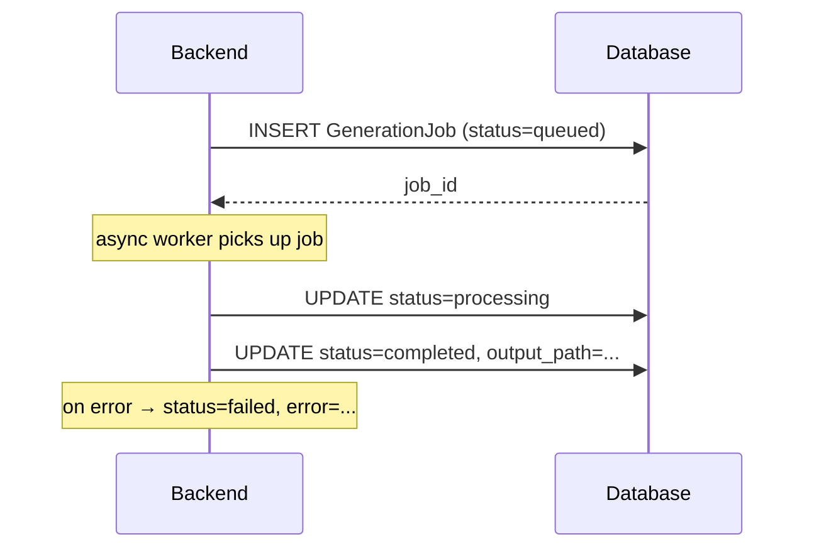
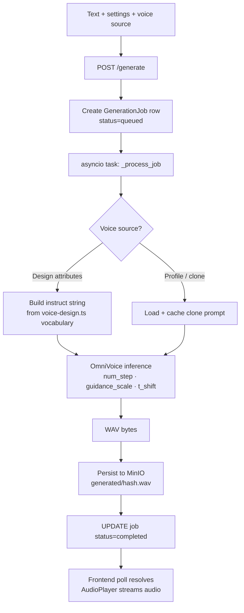
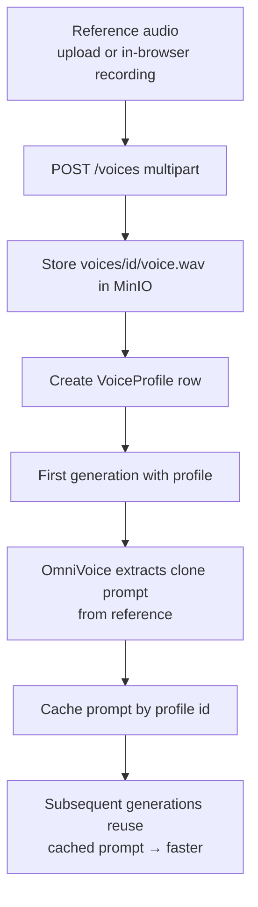
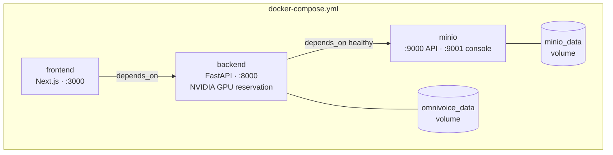

# Architecture

> Technical architecture of **OmniVoice App** — a self-hosted Voice Cloning, Text-to-Speech, and Voice Design platform built on [OmniVoice](https://github.com/k2-fsa/OmniVoice).
>
> See also: [README](../README.md) · [Roadmap](ROADMAP.md) · [Commercial Model](COMMERCIAL_MODEL.md) · [Contributing](../CONTRIBUTING.md)

---

## 1. High-Level Architecture

OmniVoice App is a two-service application — a **Next.js frontend** and a **FastAPI backend** — backed by a relational database for metadata and **MinIO** (S3-compatible) for audio objects. All services are orchestrated with Docker Compose. The OmniVoice model runs in-process inside the backend, accelerated by a GPU when available.

```mermaid
flowchart TB
    subgraph Client
        B([Browser])
    end

    subgraph Frontend["Frontend — Next.js 15 (port 3000)"]
        UI[App Router pages\nTTS · Clone · Library · History · Settings]
        RQ[TanStack Query]
        ZS[Zustand store]
    end

    subgraph Backend["Backend — FastAPI (port 8000)"]
        API[REST API layer]
        SVC[OmniVoice Service\nsingleton]
        WORK[Async job worker\nasyncio.create_task]
    end

    subgraph Engine["Inference"]
        OV[OmniVoice model\nGPU / CPU]
    end

    subgraph Data["Persistence"]
        DB[(SQLite / PostgreSQL\nmetadata)]
        S3[(MinIO\naudio objects)]
        HF[(HF model cache\n/data/models)]
    end

    B <-->|HTTP/JSON| UI
    UI --> RQ --> API
    UI --> ZS
    API --> WORK --> SVC --> OV
    OV --> HF
    API --> DB
    SVC --> S3
    API --> S3
```

**Design principles**

- **Fire-and-forget generation.** `POST /generate` returns a `job_id` immediately; the frontend polls `GET /jobs/{id}` until `completed`/`failed`. This keeps requests short and the UI responsive during long inference.
- **Single model load.** OmniVoice is loaded once at backend startup and reused; the model is offloaded to CPU after each generation to free VRAM.
- **Stateless frontend.** The frontend holds only UI/session state (Zustand) and server cache (TanStack Query); all durable state lives in the backend.
- **Pluggable persistence & storage.** SQLite and MinIO are the Community defaults; both are designed to swap for PostgreSQL and any S3-compatible store without application changes.

---

## 2. Frontend Architecture

A [Next.js 15](https://nextjs.org) App Router application (React 19, TypeScript, Tailwind, shadcn/ui).

| Route | Purpose |
| ----- | ------- |
| `/` | Text-to-Speech workspace (text input, voice selection, generation settings) |
| `/clone` | Voice Clone wizard (record/upload reference → profile) |
| `/voices` | Voice Library (CRUD over saved voice profiles) |
| `/history` | Generation history (list, replay, delete jobs) |
| `/settings` | App preferences and generation defaults |

**State management**

- **[Zustand](https://zustand-demo.pmnd.rs)** (`store/use-store.ts`) — global UI state: selected voice profile, uploaded/recorded audio, active job, generation settings, and Voice Design attributes. Reference audio comes from exactly one of three mutually exclusive sources (saved profile, upload, recording); selecting one clears the others. Output-format preference persists to `localStorage`.
- **[TanStack Query](https://tanstack.com/query)** — server cache and the generation mutation in `hooks/use-generation.ts`, which submits a job and polls to completion.

**Key modules**

| Path | Responsibility |
| ---- | -------------- |
| `lib/api.ts` | All HTTP calls; base URL from `NEXT_PUBLIC_API_URL` |
| `hooks/use-generation.ts` | Submit + poll generation jobs |
| `hooks/use-media-recorder.ts` | Browser `MediaRecorder` wrapper for in-browser capture |
| `config/voice-design.ts` | Single source of truth for the Voice Design controlled vocabulary |
| `types/index.ts` | Shared TS types (`VoiceProfile`, `JobStatus`, `GenerationRequest`, …) |

---

## 3. Backend Architecture

A [FastAPI](https://fastapi.tiangolo.com) application (Python 3.11+, async SQLAlchemy 2, Pydantic 2).

| Module | Purpose |
| ------ | ------- |
| `main.py` | App entrypoint — middleware, static `/audio` mount, fires model load as a startup background task |
| `core/config.py` | Pydantic settings (env-driven); all paths derive from `DATA_DIR` |
| `core/database.py` | Async SQLAlchemy + SQLite via `aiosqlite`; `init_db()` creates tables on startup |
| `models/db.py` | ORM models: `VoiceProfile`, `GenerationJob` |
| `schemas/` | Pydantic request/response schemas |
| `api/generation.py` | `POST /generate` → creates a job row, fires `_process_job()` as an async task; polled via `GET /jobs/{id}` |
| `api/voices.py` | CRUD for voice profiles |
| `api/health.py` | Health + model-status endpoints |
| `api/media.py` | Media/object retrieval helpers |
| `api/settings.py` | App/generation settings persistence |
| `services/omnivoice_service.py` | Singleton wrapping the OmniVoice model; loads once, offloads to CPU after generation, caches clone prompts per profile ID |
| `utils/audio.py` | WAV save/load helpers |

**API surface**

| Method | Path | Description |
| ------ | ---- | ----------- |
| GET | `/health` | Health check + model status |
| GET | `/models/status` | Detailed model loading status |
| GET/POST | `/voices` | List / create voice profiles |
| GET/PUT/DELETE | `/voices/{id}` | Read / update / delete a profile |
| GET | `/voices/{id}/audio` | Download reference audio |
| POST | `/generate` | Submit a TTS/clone/design job |
| GET | `/jobs/{id}` | Poll job status |
| GET | `/jobs/{id}/audio` | Download generated audio (WAV) |
| GET | `/jobs/{id}/audio/mp3` | On-demand MP3 (via `ffmpeg`) |

---

## 4. Database Architecture

The Community Edition uses **SQLite** via `aiosqlite` (zero-config, single file at `/data/omnivoice.db`). The data layer is written against async SQLAlchemy 2 so it can target **PostgreSQL** unchanged for multi-user/Cloud deployments — only `DATABASE_URL` changes.

- **`VoiceProfile`** — saved voices; `generation_defaults` holds preset settings and structured Voice Design attributes; reference audio is stored as an object (not a DB blob).
- **`GenerationJob`** — one row per submission; `status` transitions `queued → processing → completed | failed`. The `params` JSON captures the full request for reproducibility.

> **Migration note:** The path to PostgreSQL is a roadmap item (see [ROADMAP.md](ROADMAP.md)). SQLite remains the default for frictionless self-hosting.

---

## 5. Storage Architecture

Audio artifacts are **not** stored in the database. Reference clips and generated audio are written as objects, with the database holding only keys/paths and metadata.

| Artifact | Location | Lifecycle |
| -------- | -------- | --------- |
| Reference audio | `voices/{id}/voice.wav` | Created with a profile; deleted with it |
| Generated audio | `generated/{hash}.wav` | Created per job; retained for history |
| MP3 renditions | derived on demand | Transcoded via `ffmpeg` at request time |
| Model cache | `/data/models` (`HF_HOME`) | Downloaded once on first run |

### MinIO storage flow

MinIO is S3-compatible, so production deployments can repoint `MINIO_ENDPOINT`/credentials at AWS S3, GCS (S3 mode), or any compatible store without code changes.

### PostgreSQL persistence flow

---

## 6. Voice Generation Pipeline (Text-to-Speech & Voice Design)

**Generation parameters** (defaults in the Zustand store): `num_step` 32 (diffusion steps), `guidance_scale` 2.0, `t_shift` 0.1, `denoise` true, `speed`/`duration` auto. Voice Design enforces **one attribute per category**; the `instruct` string is derived at submit time, not stored.

---

## 7. Voice Cloning Pipeline

The clone prompt (speaker embedding/conditioning) is extracted once and cached per profile ID, so repeat generations skip re-analysis of the reference.

---

## 8. Docker Architecture

- **`backend`** mounts `omnivoice_data` at `/data` (DB + model cache + temp audio), requests all NVIDIA GPUs, and exposes a `/health` healthcheck with a 120s start period (model load).
- **`minio`** runs with a console on `:9001` and its own `minio_data` volume; the backend waits for it to be healthy.
- **`frontend`** depends on the backend and is configured via `NEXT_PUBLIC_API_URL`.

---

## 9. Health Monitoring

| Surface | Mechanism |
| ------- | --------- |
| Backend liveness | `GET /health` — returns service + model status; used by the Docker healthcheck |
| Model readiness | `GET /models/status` — detailed load progress (the model loads asynchronously after boot) |
| MinIO readiness | `mc ready local` healthcheck; backend `depends_on: minio: condition: service_healthy` |
| Job-level status | `GET /jobs/{id}` — per-generation lifecycle (`queued → processing → completed/failed`) |
| Frontend ↔ backend | Errors surfaced through TanStack Query states in the UI |

Because the model loads in the background after the process starts, the backend can report "up" while the model is still "loading" — the frontend distinguishes these via `/models/status`.

---

## 10. Future Scalability Considerations

The current architecture targets a single-node, single-user/self-hosted deployment. The path to multi-user Cloud/Enterprise (see [ROADMAP.md](ROADMAP.md) and [COMMERCIAL_MODEL.md](COMMERCIAL_MODEL.md)):

- **Stateless API + external state.** Move from SQLite to **PostgreSQL** and keep all audio in **MinIO/S3** so backend instances are horizontally scalable.
- **Dedicated inference workers.** Split the synchronous in-process model from the API: a queue (e.g. Redis/RabbitMQ) feeds a pool of GPU inference workers, decoupling request throughput from GPU capacity.
- **Multi-tenancy.** Introduce organizations/workspaces, per-tenant isolation of profiles and storage prefixes, and row-level scoping.
- **AuthN/AuthZ & API keys.** Add authentication, RBAC, and scoped API keys for programmatic access.
- **Observability.** Structured metrics (queue depth, RTF, GPU utilization), tracing, and per-tenant usage analytics for billing.
- **CDN-backed delivery.** Serve generated audio via signed URLs from object storage through a CDN instead of proxying through the API.

---

Copyright © 2026 Bruno Silva and the OmniVoice App contributors. OmniVoice App is built on [OmniVoice](https://github.com/k2-fsa/OmniVoice) (Apache-2.0); see [NOTICE](../NOTICE).
